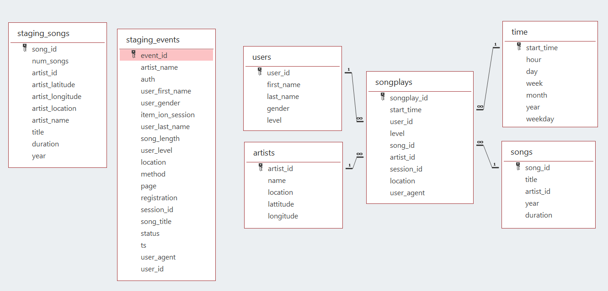

# Migrating databases to AWS Data Warehouse

A music streaming startup, Sparkify, has grown their user base and song database and want to move their processes and data onto the cloud. Their data resides in S3, in a directory of JSON logs on user activity on the app, as well as a directory with JSON metadata on the songs in their app.

As their data engineer, I'm tasked with building an ETL pipeline that extracts their data from S3, stages them in Redshift, and transforms data into a set of dimensional tables for their analytics team to continue finding insights in what songs their users are listening to. 

## What I'm going to do here?

In this project, I've apply what I learned on data warehouses and AWS to build an ETL pipeline for a database hosted on Redshift. I'm going to load data from S3 to staging tables on Redshift and execute SQL statements that create the analytics tables from these staging tables.

# Datasets

## Song Dataset
The first dataset is a subset of real data from the Million Song Dataset. Each file is in JSON format and contains metadata about a song and the artist of that song. The files are partitioned by the first three letters of each song's track ID. For example, here are filepaths to two files in this dataset.

```song_data/A/B/C/TRABCEI128F424C983.json
   song_data/A/A/B/TRAABJL12903CDCF1A.json
   ```
   
And below is an example of what a single song file, TRAABJL12903CDCF1A.json, looks like.

    {"num_songs": 1, "artist_id": "ARJIE2Y1187B994AB7", "artist_latitude": null, "artist_longitude": null, "artist_location": "", "artist_name": "Line Renaud", "song_id": "SOUPIRU12A6D4FA1E1", "title": "Der Kleine Dompfaff", "duration": 152.92036, "year": 0}

## Log Dataset
The second dataset consists of log files in JSON format generated by this event simulator based on the songs in the dataset above. These simulate app activity logs from an imaginary music streaming app based on configuration settings.

The log files in the dataset you'll be working with are partitioned by year and month. For example, here are filepaths to two files in this dataset.

    log_data/2018/11/2018-11-12-events.json
    log_data/2018/11/2018-11-13-events.json


## Schema

We have two staging tables which copy the JSON file inside the S3 buckets.

**Staging Table**
- staging_songs - info about songs and artists
- staging_events - actions done by users (which song are listening, etc.. )
I createa a star schema optimized for queries on song play analysis. This includes the following tables.

**Fact Table**
- songplays - records in event data associated with song plays i.e. records with page ```NextSong```

**Dimension Table**

- users - users in the app
- songs - songs in the database
- artists - artists in the database
- time - timestamps of records in songplays broken down into specific units

Database Schema:




## ETL pipeline

- Created tables to store the data from ```S3 buckets```.
- Loading the data from ```S3 buckets``` to staging tables in the ```Redshift Cluster```.
- Inserted data into fact and dimension tables from the staging tables.

# Files Description

- ```create_tables.py``` - This script will drop old tables (if exist) ad re-create new tables.
- ```etl.py``` - This script executes the queries that extract ```JSON``` data from the ```S3 bucket``` and ingest them to ```Redshift```.
- sql_queries.py - This file contains variables with SQL statement in String formats, partitioned by ```CREATE```, ```DROP```, ```COPY``` and ```INSERT``` statement.
- ```dhw.cfg``` - Configuration file used that contains info about ```Redshift```, ```IAM``` and ```S3```

# How to Run?

## Data Warehouse Setup

1) Create a ```IAM user``` an Attach policies
2) Give it AdministratorAccess and Attach policies
3) Use Acess Key and secret key to create clients for ```EC2```, ```S3```, ```IAM``` and ```Redshift```
4) Create an ```IAM role``` that makes ```Redshift``` able to acess ```S3 bucket``` (ReadOnly)
5) Create a ```Redshift Cluster``` and get the ```DWH_ENDPOIN(Host address)``` and ```DWH_ROLE_ARN``` and fill ```dwh.cfg```
6) Execute ```create_tables.py```
7) Execute ETL process running ```etl.py```.


